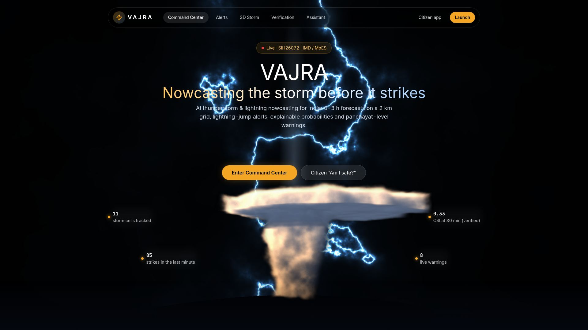
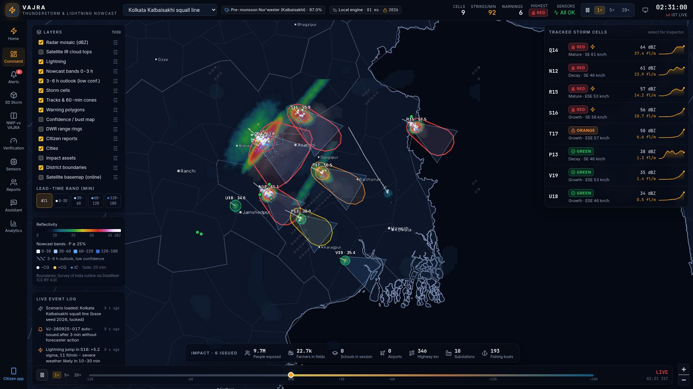
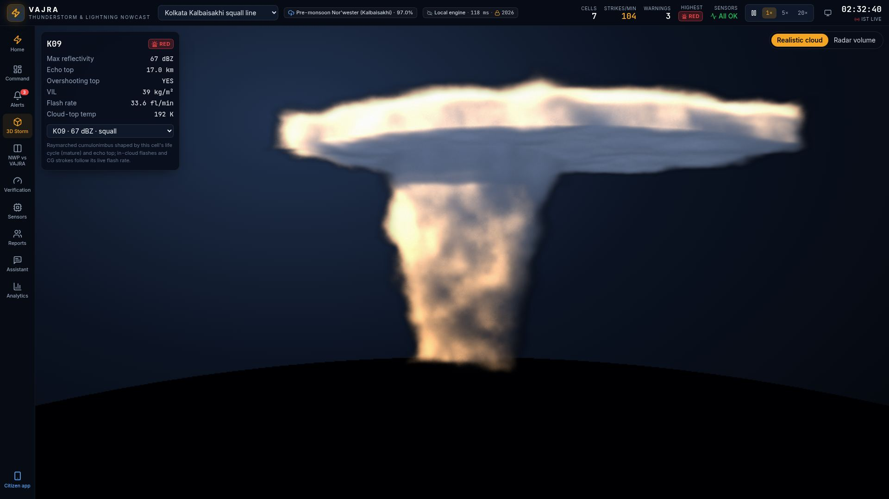
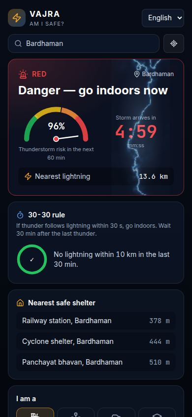

# VAJRA — AI Thunderstorm & Lightning Nowcasting (SIH26072 prototype)

VAJRA is a frontend-first prototype of an operational nowcasting system for India. It produces 0–3 h thunderstorm and lightning nowcasts on a 2 km grid (8 km verification grid), lightning-jump alerts, explainable probabilities, impact-based IMD-colour warnings down to panchayat level, CAP 1.2 feeds, and a citizen "Am I safe?" app in 8 Indian languages.

By default everything runs **fully offline** in the browser. A seeded, physics-guided simulation engine runs in a Web Worker and produces the radar, satellite, lightning and sensor data. Real feeds (DWR, INSAT-3DR/3DS via MOSDAC, lightning network, NWP, AWS) plug into the same `DataAdapter` interface. An optional FastAPI backend serves the same engine over REST and WebSocket, and proxies the LLM assistant (the API key stays server-side).



| Command Center | 3D storm (raymarched cloud) | Citizen app |
| --- | --- | --- |
|  |  |  |

More screenshots are in [`docs/screenshots/`](docs/screenshots).

---

## Quick start (Windows PowerShell)

Prerequisites: **Node.js 20+** (22 LTS recommended) and **Python 3.11+** (only needed for the optional API).

```powershell
git clone https://github.com/Akshayg005/Sparkzzz.git
cd Sparkzzz
git checkout claude/gallant-wright-t6xzx5

# one-time setup: npm workspaces + Python venv for the API
.\scripts\setup.ps1

# start everything (web on :5173, API on :8000) and open the landing page
.\scripts\dev.ps1
```

If PowerShell blocks the scripts, run `Set-ExecutionPolicy -Scope Process -ExecutionPolicy Bypass` in that window first.

### Web app only (no Python needed)

```powershell
npm install
npm run dev
# open http://localhost:5173/#/welcome
```

### With the API

```powershell
cd apps\api
python -m venv .venv
.\.venv\Scripts\python -m pip install -r requirements-dev.txt
.\.venv\Scripts\python -m uvicorn app.main:app --port 8000
# Swagger UI: http://localhost:8000/docs
```

Then open `http://localhost:5173/?source=api#/` to drive the UI from the API's WebSocket. If the API goes away, the UI falls back to the local engine with the same seed and shows an "API lost" chip.

### Docker (web + API)

```powershell
docker compose up --build
# web: http://localhost:8080   API: http://localhost:8000/docs
```

### Production build

```powershell
.\scripts\build.ps1          # lint + typecheck + unit tests + build + preview on :4173
# or
npm run build; npm run preview
```

---

## Rehearsal mode: the same storms every time

The engine is fully seeded. By default the seed is derived from the date plus the session, so every run looks different. Lock the seed for a demo:

```powershell
.\scripts\rehearsal.ps1 -Seed 2026      # or open http://localhost:5173/?seed=2026#/welcome
```

With a locked seed, the cells, strikes, alerts and sensor faults are identical on every run. You can also lock or unlock the seed in Director Mode.

---

## Routes

| Route | What it is |
| --- | --- |
| `#/welcome` | Landing page: Odyssey lightning hero with a live raymarched cumulonimbus, parallax storm scene, scroll choreography, scenario carousel, liquid "monsoon glass" section |
| `#/` | **Command Center**: radar/IR/lightning map, nowcast bands, tracks and 60-min cones, warning polygons, cell list, event log, impact strip, time scrubber (−120 … +180 min) |
| `#/alerts` | Alert Center: drafts → issue / merge / suppress / edit polygon, 8-language bulletin preview, CAP 1.2 XML, CSV, print/PDF sheet, delivery counters |
| `#/storm3d` | 3D Storm: **Realistic cloud** (raymarched Cb driven by the cell's life cycle and flash rate) or **Radar volume** (dBZ point cloud, charge tripole, bolts) |
| `#/compare` | Coarse NWP vs VAJRA 2 km nowcast, side by side |
| `#/verification` | Verification Lab: POD / FAR / CSI / ETS / FSS / Brier vs lead time, reliability diagram, VAJRA vs extrapolation vs persistence |
| `#/sensors` | Sensor Health: fusion trust diagram, sensor map, anomaly timeline (spikes, frozen, drift, dropouts) |
| `#/reports` | Citizen Reports: Zod-validated form with photo, auto-verification against radar and lightning |
| `#/assistant` | VAJRA Assistant: grounded in live engine state, streaming answers, voice in and out, 8 languages |
| `#/analytics` | CG lightning density, district ranking, strike histograms, storm gallery replay |
| `#/public` (or `#/citizen`) | Citizen "Am I safe?": risk dial, arrival countdown, 30-30 rule, nearest shelter, persona advice |

## Director Mode (for the demo)

Press **Shift + D** anywhere, or open the side panel, to use:
- scenario switcher (6 Indian presets)
- spawn a storm where you click
- force a lightning jump
- speed 1× / 5× / 20×
- seed lock
- sensor-failure injection
- the resilience drill, which crashes the engine worker and watches it auto-recover

| Key | Action |
| --- | --- |
| `Shift + D` | Director Mode |
| `Space` | Pause / play |
| `1` / `5` / `2` | Speed 1× / 5× / 20× |
| `[` / `]` / `0` | Scrub −15 min / +15 min / back to now |
| `P` | Projector mode (bigger type, higher contrast) |
| `Esc` | Close drawer / picker / Director |

URL flags: `?seed=1234` (lock seed), `?nointro` (skip the globe intro), `?source=api` (use the FastAPI backend).

---

## Environment variables

| Variable | Where | Default | Purpose |
| --- | --- | --- | --- |
| `VAJRA_SEED` | API | random | Lock the API engine seed |
| `VAJRA_SCENARIO` | API | `kolkata-kalbaisakhi` | Starting scenario |
| `VAJRA_CORS_ORIGINS` | API | localhost dev and preview ports | Comma-separated allowed origins |
| `ANTHROPIC_API_KEY` | API | *(unset)* | Enables LLM phrasing for the assistant. **Server-side only, never in the bundle.** Without it the assistant uses templated, grounded answers |
| `VAJRA_LLM_MODEL` | API | `claude-opus-5` | Model for the assistant proxy |
| `VAJRA_DB` | API | `apps/api/data/vajra.db` | SQLite path for reports and alerts |
| `VAJRA_API` | Vite dev | `http://localhost:8000` | Where the dev proxy forwards `/api` and `/ws` |
| `PW_CHROMIUM_PATH` | Playwright | *(bundled)* | Use a preinstalled Chromium for e2e tests |

```powershell
$env:ANTHROPIC_API_KEY = 'sk-ant-...'   # only in the API's shell
```

---

## Tests and quality gates

```powershell
npm run lint          # ESLint: no `any`, no Math.random outside the engine PRNG
npm run typecheck     # strict TypeScript
npm run test          # Vitest: 38 tests (determinism, coupling, lightning jump, verification maths, alerts, XAI, CAP, CSV, i18n)
npx playwright install chromium   # once
npm run test:e2e      # Playwright: every route, alert flow, downloads, director, crash recovery, offline, mobile, landing, 3D toggle
cd apps\api; .\.venv\Scripts\python -m pytest -q     # 11 API tests
```

---

## Repository layout

```
apps/web            React 18 + Vite + TS strict + Tailwind + Zustand + MapLibre/deck.gl + three.js
  src/engine        seeded physics engine (Web Worker): cells, lightning, optical flow, model, alerts, sensors, verification
  src/data          DataAdapter: SimulationAdapter (default), ApiAdapter, feed stubs (DWR, INSAT, LLN, NWP, AWS)
  src/components/ui storm components (Lightning, RealisticStorm, ParallaxStorm, ScrollChoreography, SqueezeCarousel, Liquid)
  src/pages         routes listed above
  public/geo        Survey-of-India-compliant outline, states and districts (offline)
apps/api            FastAPI + pydantic + SQLite: REST, WebSocket, CAP builder, LLM proxy, rate limits, security headers
packages/contracts  shared TypeScript types
docs/               PLAN, ARCHITECTURE, JUDGE_QA, DEMO_SCRIPT, AUDIT_REPORT, screenshots
scripts/            PowerShell: setup, dev, build, rehearsal
```

## Docs

- [docs/PLAN.md](docs/PLAN.md): full plan (A–N) and feature map
- [docs/ARCHITECTURE.md](docs/ARCHITECTURE.md): diagrams and data flow
- [docs/DEMO_SCRIPT.md](docs/DEMO_SCRIPT.md): 6-minute demo
- [docs/JUDGE_QA.md](docs/JUDGE_QA.md): likely judge questions and answers
- [docs/AUDIT_REPORT.md](docs/AUDIT_REPORT.md): QA audit, risks, next upgrades

## Data and compliance notes

- **Boundaries:** India outline from the DataMeet Survey-of-India-compliant set (CC BY 4.0), with the full J&K and Ladakh. States and districts are bundled offline. The satellite basemap is optional and off by default.
- **No official logos:** there are no IMD or MoES logos. IMD warning colours (green / yellow / orange / red) are used only for severity.
- **Simulated data:** all default data is simulated and clearly labelled as a prototype. The verification scores come from the engine's own forecast-vs-truth bookkeeping. They are not claims about real-world skill.
