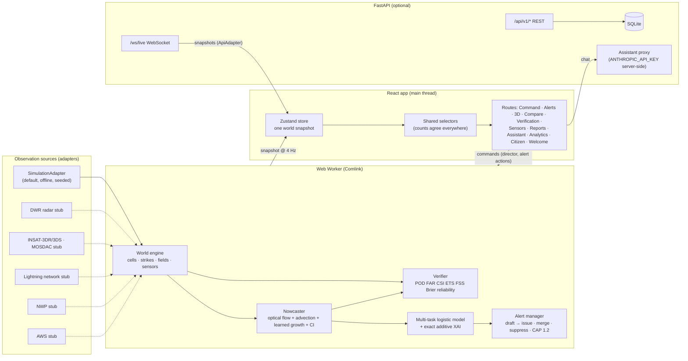
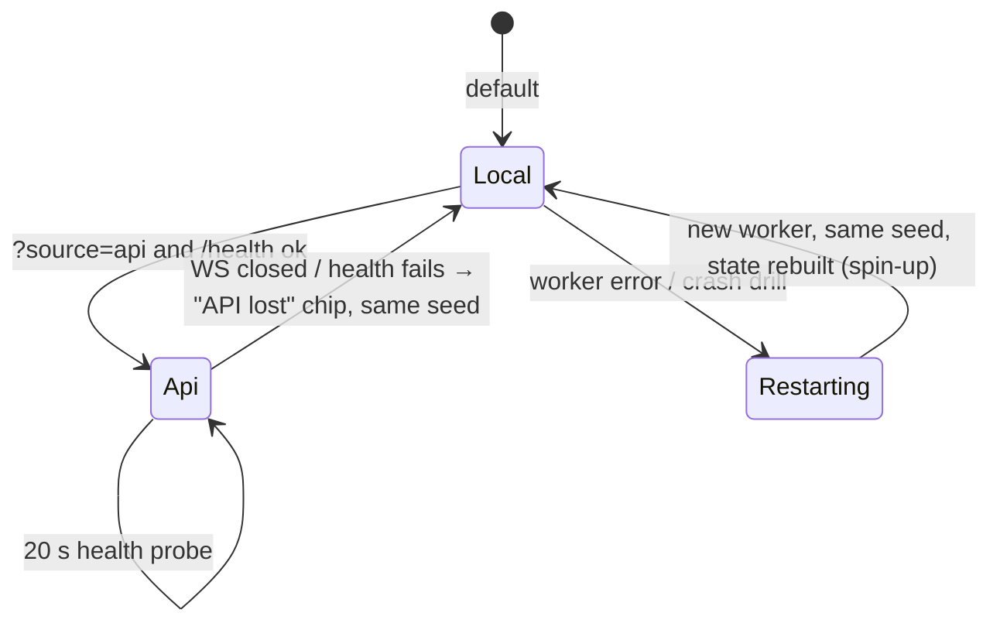
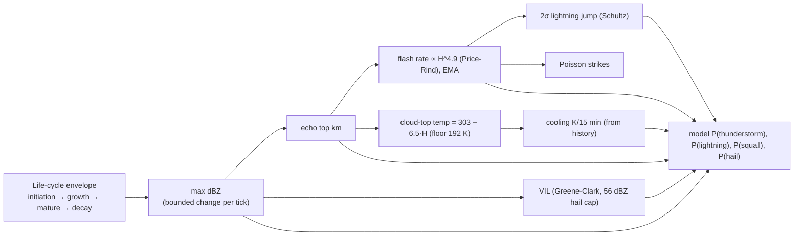

# VAJRA architecture

## 1. System overview



## 2. Data flow per tick

```mermaid
sequenceDiagram
  autonumber
  participant C as Clock (real IST, speed ×1/×5/×20)
  participant W as World (worker)
  participant N as Nowcaster
  participant A as AlertManager
  participant S as Store (UI)
  C->>W: tick(dt) every 250 ms
  W->>W: cells: envelope → dBZ → echo top → VIL → flash rate (EMA) → CTT (history-based)
  W->>W: Poisson strikes (CG ≈ 22 %, +CG share), 2σ lightning-jump test
  W->>W: sensors: faults, detectors with hysteresis, trust weights
  W->>N: every 5 sim-min: render dBZ grid, block-match motion, advect 0–180 min
  N->>N: learned-lifecycle growth (imperfect skill), CI term, neighbourhood probability
  N->>A: cell probabilities + XAI contributions (sum = P exactly)
  A->>A: severity → draft; auto-issue red / after 3 min; fatigue guard (merge/suppress)
  W->>W: Verifier stores forecasts, scores them when truth arrives
  W-->>S: snapshot (latency jitter 40–400 ms, occasional dropout)
  S-->>S: selectors: live alerts, worst severity, impact totals
```

## 3. Resilience



- **Worker crash:** `SimulationAdapter.recover()` starts a new worker with the same seed and scenario. The UI shows a "recovering" chip and never goes blank.
- **API down:** the Vite dev plugin answers `/api/v1/health` with `{ok:false}` rather than a proxy 500. The UI stays on the local engine.
- **Per-route error boundaries:** a crash in one page shows a retry card; the rest of the app keeps running.
- **Offline:** the basemap, boundaries, textures, fonts and three.js assets are all bundled. The Playwright offline test blocks all external requests.

## 4. Engine physics coupling



## 5. Front-end structure

| Layer | Files | Notes |
| --- | --- | --- |
| Engine (worker) | `src/engine/*` | The only place randomness is allowed: `mulberry32` + simplex noise, enforced by ESLint |
| Adapters | `src/data/adapters.ts`, `apiAdapter.ts` | Same `DataAdapter` interface for simulation, API and real-feed stubs |
| Store | `src/store.ts`, `src/selectors.ts` | One snapshot; derived counts come only from selectors |
| Map | `src/map/*` | MapLibre GL 6 + deck.gl `MapboxOverlay`, bitmap rasters (retired after 3 s to avoid GPU detach warnings) |
| Storm UI kit | `src/components/ui/*` | `Lightning` (WebGL, Odyssey), `VolumetricStorm` (full-screen volumetric raymarcher: tileable Perlin-Worley 3D noise, HG phase, multiple-scattering octaves, adaptive stepping and resolution), `RealisticStorm` (lightweight hero cloud), `ParallaxStorm`, `ScrollChoreography`, `SqueezeCarousel`, `LiquidEffectAnimation`, `Reveal`, `StormHero` |
| Pages | `src/pages/*` | Route-level lazy chunks; three.js and ECharts load on demand |

Budget: the initial JS is about 119 KB gzip. The map chunk (about 540 KB gzip) loads with the Command Center. three.js, ECharts and liquid1 are lazy.

## 6. Backend

| Endpoint | Purpose |
| --- | --- |
| `GET /api/v1/health` | Engine status, LLM availability |
| `GET /api/v1/nowcast?lat&lng` | Point nowcast (probabilities, ETA, XAI) |
| `GET /api/v1/cells` · `GET /api/v1/alerts` | Current cells and alerts |
| `GET /api/v1/alerts/{id}/cap.xml` | CAP 1.2 XML |
| `POST /api/v1/reports` · `GET /api/v1/reports` | Citizen reports (sanitised, rate-limited, stored in SQLite) |
| `POST /api/v1/assistant` | Grounded assistant; LLM phrasing only when a key is configured |
| `POST /api/v1/director` | Demo controls |
| `WS /ws/live` | Snapshot stream |

Security:
- CORS allow-list from `VAJRA_CORS_ORIGINS`
- sliding-window rate limits
- CSP and security headers
- pydantic validation and input sanitisation
- the LLM key never leaves the server
